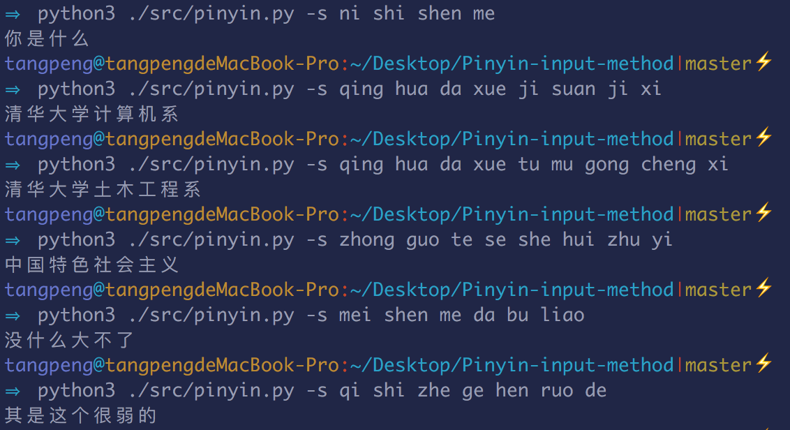

# 基于二元模型的拼音输入法

本程序使用python3,不涉及任何第三方包。

### 文件目录结构

- src:
    - prepro.py:预处理python程序,用来从语料中提取统计信息。
    - pinyin.py:将拼音转换成文字的python程序。


- data:
    - pinyin_data:从语料库中提取的统计信息。
    - input.txt:输入拼音文件。
    - output.txt:输出汉字文件。


- train_data:空。可以将全部语料文件放入进行训练。


### 使用方法

#### 预处理
进入本文件夹目录，执行：
```
python3 src/prepro.py -src train_data -o data/pinyin_data
```

其中-src指定语料库的文件夹(对于多文件)或者单一文件路径。需要将语料文件提前准备好。

#### 进行拼音转换

进入本文件夹目录，执行：
```
python3 src/pinyin.py -i data/input.txt -o data/output.txt
```
就可以将data/input.txt的拼音转换成汉字并且输出到data/output.txt文件中。

或者可以直接进行转换：
```
>>python3 src/pinyin.py -s qing hua da xue ji suan ji xi
>>清华大学计算机系
```

效果如下，速度还是很快的：

</img>

可以直接得到结果。
